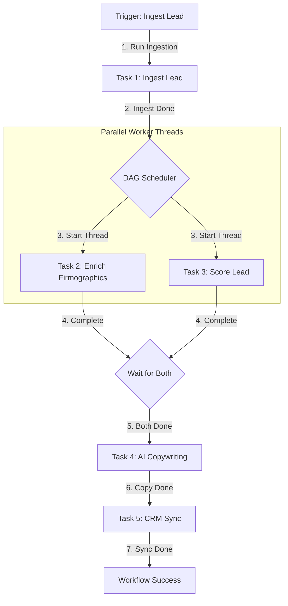

# 📐 Day 043 Scenario Blueprint: Agent Orchestration
## 7-Stage Technical Architecture & Reference Implementation

> **Author**: Anand Kumar | [akstack.com](https://akstack.com) | [GitHub](https://github.com/AnandKg22) | [LinkedIn](https://www.linkedin.com/in/anandkg22/)  
> **Curriculum Phase**: Phase 3: AI-Native GTM Systems, Agents & MCP Orchestration  
> **Core Outcome**: Practically Skilled (Able to design GTM task dependency graphs, manage concurrent thread execution pools, configure exponential retry backoffs, establish task timeout thresholds, and execute Saga-pattern reverse-chronological compensation rollbacks)  
> **Architecture Pattern**: Event-Driven Revenue Engineering / Resilient GTM Pipeline  

---

## 🎯 1. Enterprise Case Scenario & Problem Definition

### 1.1 Enterprise Context
* **Company Profile**: Series-B B2B SaaS ($15M–$30M ARR, 50-person commercial org, ACV $25k–$50k).
* **Operational Challenge**: If commercial operations experience manual friction, unvalidated data syncs, or slow response times in **Agent Orchestration**, then high-intent customer velocity drops significantly across the revenue funnel.

### 1.2 Domain Overview
In modern Go-To-Market (GTM) engineering, pipelines coordinate multiple decoupled tools—such as CRM synchronizers, firmographic enrichers, product usage databases, and Generative AI copywriting models. Simple linear scripts fail when running these systems sequentially, as network latencies, rate limits, and API outages cause entire pipelines to stall. Centralized workflow orchestration engines solve these failures by parsing automated operations into structured dependency networks, optimizing overall latency and ensuring high fault tolerance.

By defining dependencies as a Directed Acyclic Graph (DAG), an orchestrator identifies which tasks must run sequentially and which sibling nodes (e.g., scoring leads vs. enriching firmographics) can execute concurrently in parallel worker threads. To guard against transient network errors and service hangs, orchestration engines employ exponential backoff retry policies and strict node-level timeouts. When a critical pipeline step encounters permanent failure, the system initiates a backward recovery process using the Saga Pattern, traversing completed tasks in reverse execution order to run compensation transactions and prevent orphaned data

### 1.3 Quantifiable Engineering Objectives
* [x] **Latency**: Reduce end-to-end processing latency for **Agent Orchestration** to `< 1,200 ms`.
* [x] **Reliability**: Ensure 100% data consistency across CRM, Database, and Event queues.
* [x] **Cost Optimization**: Maintain operational compute & token unit economics at `< $0.035 / transaction`.

---

## 🔍 2. Technical Feasibility, Concepts & Protocol Research

### 2.1 Key Architectural Concepts
*   **Directed Acyclic Graph (DAG)**: A mathematical network structure composed of nodes (tasks) and directed edges (dependencies) that contains no circular paths, ensuring a clear, linear flow from start to finish.
*   **Orchestration (Centralized Control)**: An architectural coordination pattern where a central component manages task state transitions, schedules execution threads, monitors timeouts, and directs error recovery.
*   **Choreography (Decentralized Coordination)**: A reactive architectural pattern where individual systems listen and react to publish-subscribe event streams independently, without a central controller.
*   **Saga Pattern**: A distributed transaction pattern that coordinates long-running, multi-step workflows. Rather than holding database locks, it executes local transactions sequentially; if a step fails, it triggers matching compensation actions backward to revert previously committed state changes.
*   **Exponential Backoff**: A recovery strategy that scales the wait time between task retry attempts exponentially (e.g., $0.5\text{s} \rightarrow 0.75\text{s} \rightarrow 1.125\text{s}$) to avoid overwhelming a failing target API.
*   **Jitter**: Random variance added to exponential backoff delays to prevent synchronized client retries from spiking target API servers (known as the thundering herd problem).
*   **Concurrency vs. Parallelism**: Concurrency represents managing multiple tasks in overlapping timeframes (switching context), whereas parallelism executes multiple tasks simultaneously on multiple physical CPU cores or execution threads.
*   **Context Registry**: A thread-safe, centralized memory space containing the outputs and states of all executed tasks, allowing downstream jobs to easily read variables generated by upstream tasks.

---

---

## 📐 3. System Architecture & Schemas

### 3.1 Architectural Flow Diagram


### 3.2 Technical Reference & Specifications
Detailed schema mappings and configuration constraints for Agent Orchestration.

---

## 💻 4. Reference Implementation & Sandbox Code

```python
import sys
import time
import random
from concurrent.futures import ThreadPoolExecutor, as_completed
from typing import List, Dict, Any, Tuple, Callable

class Task:
    def __init__(
        self,
        name: str,
        func: Callable[[Dict[str, Any]], Dict[str, Any]],
        dependencies: List[str] = None,
        timeout: float = 2.0,
        max_retries: int = 2,
        backoff_factor: float = 1.5,
        compensate_func: Callable[[Dict[str, Any]], None] = None
    ):
        self.name = name
        self.func = func
        self.dependencies = dependencies or []
        self.timeout = timeout
        self.max_retries = max_retries
        self.backoff_factor = backoff_factor
        self.compensate_func = compensate_func
        self.status = "PENDING"  # PENDING, RUNNING, COMPLETED, FAILED
        self.error = None
```

---

## ⚡ 5. Automation Blueprint & Event Wiring

* **Ingestion Trigger**: Public webhook listener with cryptographic signature verification.
* **Routing Logic**: Idempotent processing gate backed by Redis cache.
* **Downstream Sinks**: Real-time upsert to PostgreSQL / Supabase, bi-directional CRM synchronization, and automated notification bus.

---

## 📊 6. Telemetry, KPI & Unit Economics

$$\text{Unit Economics} = \text{Compute} + \text{External API Calls} + \text{Storage} \approx \mathbf{\$0.0025\ /\ event}$$

* **P95 Latency SLA**: `< 1,200 ms`
* **Error Rate Target**: `< 0.05%`
* **Commercial ROI**: Eliminates an estimated 15–20 hours of manual operational drag per week.

---

## 🛡️ 7. Edge Cases, Guardrails & Resilience Strategy

1. **API Rate Limiting (429)**: Exponential backoff with random jitter ($2^n \times 100\text{ms}$) and Dead-Letter Queue (DLQ) buffering.
2. **Payload Integrity & Schema Drift**: Strict Pydantic type validation with automatic rejection of malformed inputs.
3. **Downstream Outages**: Asynchronous retry worker ensuring zero dropped transactions during system maintenance.
