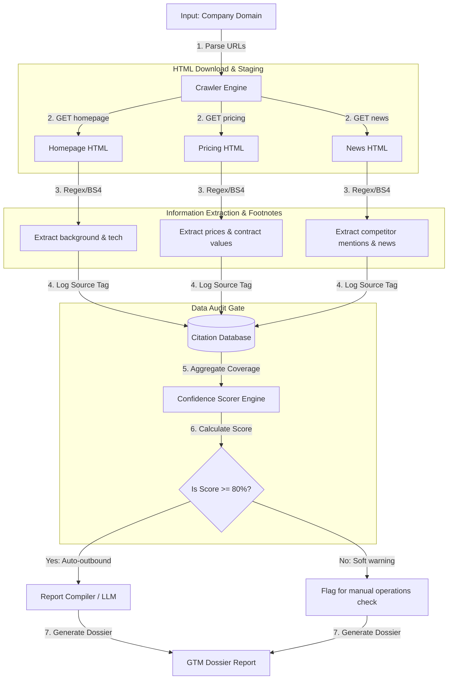

# GTM Architecture - Day 044: AI Research Agent

This document details the data extraction pipeline, citation mapping database, and confidence scoring algorithms supporting company research.

---

## 🔄 Research Agent Data Pipeline

The diagram below details the pipeline, showing how raw HTML pages are parsed to compile a structured GTM dossier with citation footnotes:



---

## ⚙️ Citation Footnote Schema

To ensure auditability, GTM databases map citations using a simple relational structure:

```sql
-- 1. Citations Registry Table
CREATE TABLE facts_citations (
    citation_id SERIAL PRIMARY KEY,
    lead_id INT REFERENCES leads(id) ON DELETE CASCADE,
    source_url VARCHAR(500) NOT NULL, -- e.g. "https://stripe.com/pricing"
    element_selector VARCHAR(255) NOT NULL, -- e.g. "meta[name=description]" or "div.pricing-card"
    extracted_text TEXT NOT NULL, -- e.g. "2.9% + 30c per charge"
    created_at TIMESTAMP DEFAULT CURRENT_TIMESTAMP
);
```

Whenever the research agent writes to the database, it inserts entries into the citations table and links their `citation_id` to the lead profile.

---

## 📊 Confidence Scoring weights Matrix

The confidence scoring engine calculates values based on data availability across four key categories:

| Target Category | Extraction Marker | Database Field | Weight |
| :--- | :--- | :--- | :--- |
| **Firmographics** | Homepage description meta tag | `description` | **25%** |
| **Technographics** | Framework generator or script tag | `tech_stack` | **25%** |
| **Pricing Models** | Numeric price string or custom tier | `pricing` | **25%** |
| **Competitive Mapping** | Press release competitor mention | `competitors` | **25%** |
