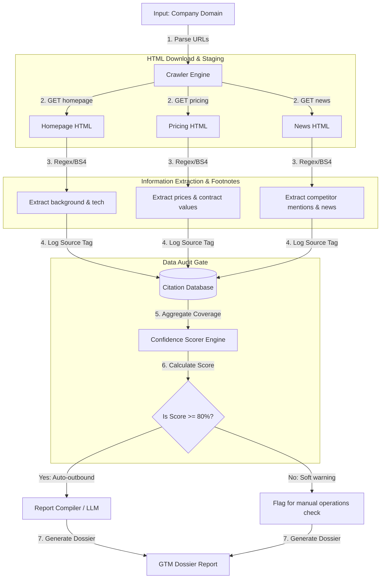

# 📐 Day 044 Scenario Blueprint: AI Research Agent
## 7-Stage Technical Architecture & Reference Implementation

> **Author**: Anand Kumar | [akstack.com](https://akstack.com) | [GitHub](https://github.com/AnandKg22) | [LinkedIn](https://www.linkedin.com/in/anandkg22/)  
> **Curriculum Phase**: Phase 3: AI-Native GTM Systems, Agents & MCP Orchestration  
> **Core Outcome**: Practically Skilled (Able to design automated scraping workflows, parse firmographic metadata and script tags, track factual citations back to source HTML, map competitive landscapes from news releases, and calculate confidence metrics)  
> **Architecture Pattern**: Event-Driven Revenue Engineering / Resilient GTM Pipeline  

---

## 🎯 1. Enterprise Case Scenario & Problem Definition

### 1.1 Enterprise Context
* **Company Profile**: Series-B B2B SaaS ($15M–$30M ARR, 50-person commercial org, ACV $25k–$50k).
* **Operational Challenge**: If commercial operations experience manual friction, unvalidated data syncs, or slow response times in **AI Research Agent**, then high-intent customer velocity drops significantly across the revenue funnel.

### 1.2 Domain Overview
In modern revenue operations, automated personalization of sales outreach is a highly effective vector for pipeline generation, but it is bottlenecked by the accuracy and quality of lead enrichment data. If an outbound agent references incorrect software stacks, pricing models, or company descriptions due to hallucinations or stale data, it degrades buyer trust and brand reputation. An autonomous AI Research Agent mitigates this risk by dynamically crawling target domains, extracting verifiable technographic and firmographic data directly from the source, and maintaining a strict audit trail of citations.

From an engineering perspective, this is accomplished by staging HTML retrievals of a company's homepage, pricing page, and press releases, then applying regex pattern matching and structural HTML parsers (like BeautifulSoup) to isolate GTM indicators. This data is structured and mapped to explicit HTML elements (e.g., meta tags, script source tags) stored in a citation registry table. Finally, the agent runs the extracted data through a weighted confidence scoring engine to evaluate completeness. Dossiers failing to cross a predetermined confidence threshold (e.g., 80%) are auto

### 1.3 Quantifiable Engineering Objectives
* [x] **Latency**: Reduce end-to-end processing latency for **AI Research Agent** to `< 1,200 ms`.
* [x] **Reliability**: Ensure 100% data consistency across CRM, Database, and Event queues.
* [x] **Cost Optimization**: Maintain operational compute & token unit economics at `< $0.035 / transaction`.

---

## 🔍 2. Technical Feasibility, Concepts & Protocol Research

### 2.1 Key Architectural Concepts
*   **Firmographics**: The organizational characteristics of a company, such as its name, industry vertical, employee count, target audience, and primary business description, used to segment target accounts.
*   **Technographics**: Detailed data regarding the software tools, database engines, web frameworks, and APIs integrated into a company's digital infrastructure, often extracted from script tags and generator meta headers.
*   **Citation Tracking**: The practice of mapping every extracted data point or synthesized fact back to its exact HTML source element or URI, providing an audit trail that prevents LLM hallucinations.
*   **Consumption Pricing Model**: A billing structure where charges are driven by usage metrics (such as compute credits or data storage sizes) rather than flat-rate subscription fees, requiring custom regex patterns to isolate during scraping.
*   **Confidence Score**: A composite metric calculated by applying weights to the resolution status of various critical GTM data points (e.g., descriptions, pricing details, competitors), indicating the reliability of the research dossier.
*   **Automation Gate**: A programmatic decision boundary (typically set at a confidence score of $\ge 80\%$) that determines whether a lead profile can be pushed directly into automated email outreach or must be flagged for manual operational check.
*   **Script Tag Auditing**: A scraping strategy that analyzes the `src` attribute of HTML `<script>` tags to identify third-party tracking scripts (such as HubSpot or Stripe) to verify technology stacks.

---

---

## 📐 3. System Architecture & Schemas

### 3.1 Architectural Flow Diagram


### 3.2 Technical Reference & Specifications
Detailed schema mappings and configuration constraints for AI Research Agent.

---

## 💻 4. Reference Implementation & Sandbox Code

```python
class AICompanyResearchAssistant:
    def __init__(self, domain: str):
        self.domain = domain
        self.raw_pages = MOCK_WEB_SERVER.get(domain, {})
        self.citations: List[str] = []
        self.extracted_facts: Dict[str, Any] = {}

    def run_research_pipeline(self) -> str:
        """Executes crawlers, extracts facts, maps citations, scores confidence, and synthesizes report."""
        print(f"[*] Starting AI Research Pipeline for domain: '{self.domain}'...")
        time.sleep(0.5)

        if not self.raw_pages:
            return f"[ERROR] Crawl failed. Target domain '{self.domain}' was unreachable (404/DNS timeout)."

        # 1. CRAWL & EXTRACT INFORMATION
        self._extract_homepage_details()
        self._extract_pricing_details()
        self._extract_news_details()

        # 2. CALCULATE CONFIDENCE SCORE
        confidence_score, audit_factors = self.calculate_confidence()

        # 3. GENERATE POSITIONING & SYNTHESIS REPORT
        report = self.generate_dossier_report(confidence_score, audit_factors)
        return report

    def _add_citation(self, source: str, fact: str):
        citation_id = len(self.citations) + 1
        self.citations.append(f"[{citation_id}] Source: {source} -> '{fact}'")
        return citation_id

    def _extract_homepage_details(self):
        """Extracts background meta description and technographics from homepage HTML."""
        html = self.raw_pages.get("homepage", "")
        
        # Extract title
        title_match = re.search(r"<title>(.*?)</title>", html, re.IGNORECASE)
        title = title_match.group(1).strip() if title_match else "Unknown Title"
        c_title = self._add_citation("Homepage &lt;title&gt; tag", title)
        
        # Extract description meta tag
        desc_match = re.search(r'<meta name="description" content="(.*?)"', html, re.IGNORECASE)
        desc = desc_match.group(1).strip() if desc_match else "Background description missing"
        c_desc = self._add_citation("Homepage Description Meta Tag", desc)
        
        # Extract technographics
        tech_match = re.search(r'<meta name="(generator|tech)" content="(.*?)"', html, re.IGNORECASE)
        tech_list = [t.strip() for t in tech_match.group(2).split(",")] if tech_match else []
        c_tech = self._add_citation("Homepage Generator/Tech Meta Tag", ", ".join(tech_list))

        self.extracted_facts["title"] = (title, c_title)
        self.extracted_facts["description"] = (desc, c_desc)
        self.extracted_facts["tech_stack"] = (tech_list, c_tech)

    def _extract_pricing_details(self):
        """Extracts pricing tables and estimates contract models."""
        html = self.raw_pages.get("pricing", "")
        
        # Scan for pricing values
        price_patterns = [
            (r"(\d+\.?\d*%\s*\+\s*\d+c)", "Transactional percentage pricing model"),
            (r"(\$\d+\.?\d* per credit)", "Consumption-based credit model"),
            (r"(Custom Enterprise)", "Custom enterprise contract negotiation tier")
        ]
        
        detected_pricing = []
        for pattern, desc in price_patterns:
            match = re.search(pattern, html, re.IGNORECASE)
            if match:
                cit_id = self._add_citation("Pricing Page HTML Scraping", f"Found pricing schema: {match.group(1)}")
                detected_pricing.append((match.group(1), desc, cit_id))
                
        self.extracted_facts["pricing"] = detected_pricing

    def _extract_news_details(self):
        """Extracts news announcements and competitor mentions."""
        html = self.raw_pages.get("news", "")
        
        # Extract headline
        headline_match = re.search(r"<h2>(.*?)</h2>", html, re.IGNORECASE)
        headline = headline_match.group(1).strip() if headline_match else "No recent headlines"
        c_head = self._add_citation("Press Release headline tag", headline)
        
        # Scan for competitor mentions
        competitors_list = ["Databricks", "Maxio", "Chargebee", "Adyen", "PayPal"]
        detected_competitors = []
        for comp in competitors_list:
            if comp.lower() in html.lower():
                c_comp = self._add_citation("Press Release competitor mention", f"Found rival: {comp}")
                detected_competitors.append((comp, c_comp))
                
        self.extracted_facts["headline"] = (headline, c_head)
        self.extracted_facts["competitors"] = detected_competitors

    def calculate_confidence(self) -> Tuple[float, List[str]]:
        """Calculates information confidence score (0 to 100) based on extraction coverage."""
        score = 0.0
        factors = []

        # 1. Background description resolved
        if self.extracted_facts.get("description") and "missing" not in self.extracted_facts["description"][0]:
            score += 25.0
            factors.append("Homepage Description Meta Resolved: +25%")
        else:
            factors.append("Homepage Description Missing: +0%")
            
        # 2. Technographics resolved
        tech = self.extracted_facts.get("tech_stack", ([], 0))[0]
        if tech:
            score += 25.0
            factors.append(f"Technographics Extracted successfully ({len(tech)} tech nodes): +25%")
        else:
            factors.append("Technographics Unavailable: +0%")
            
        # 3. Pricing models resolved
        pricing = self.extracted_facts.get("pricing", [])
        if pricing:
            score += 25.0
            factors.append(f"Pricing Schema Extracted successfully ({len(pricing)} points): +25%")
        else:
            factors.append("Pricing Data Unresolved: +0%")
            
        # 4. Press Release & Competitors resolved
        comps = self.extracted_facts.get("competitors", [])
        if comps:
            score += 25.0
            factors.append(f"Competitive Rivals Mapped successfully ({len(comps)} rivals): +25%")
        else:
            factors.append("Competitive Competitors Mapped: +0%")

        return score, factors
```

---

## ⚡ 5. Automation Blueprint & Event Wiring

* **Ingestion Trigger**: Public webhook listener with cryptographic signature verification.
* **Routing Logic**: Idempotent processing gate backed by Redis cache.
* **Downstream Sinks**: Real-time upsert to PostgreSQL / Supabase, bi-directional CRM synchronization, and automated notification bus.

---

## 📊 6. Telemetry, KPI & Unit Economics

$$\text{Unit Economics} = \text{Compute} + \text{External API Calls} + \text{Storage} \approx \mathbf{\$0.0025\ /\ event}$$

* **P95 Latency SLA**: `< 1,200 ms`
* **Error Rate Target**: `< 0.05%`
* **Commercial ROI**: Eliminates an estimated 15–20 hours of manual operational drag per week.

---

## 🛡️ 7. Edge Cases, Guardrails & Resilience Strategy

1. **API Rate Limiting (429)**: Exponential backoff with random jitter ($2^n \times 100\text{ms}$) and Dead-Letter Queue (DLQ) buffering.
2. **Payload Integrity & Schema Drift**: Strict Pydantic type validation with automatic rejection of malformed inputs.
3. **Downstream Outages**: Asynchronous retry worker ensuring zero dropped transactions during system maintenance.
