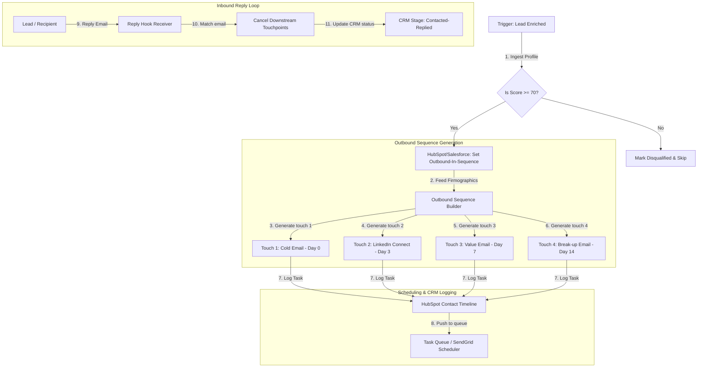

# GTM Architecture - Day 045: AI SDR Agent v2

This document details the campaign scheduling engine, message sequencing structures, and CRM integration gates supporting AI Sales Development Representative (SDR) agents.

---

## 🔄 AI SDR v2 Campaign Pipeline

The diagram below details the pipeline, showing how leads are qualified, compiled into multi-step outreach sequences, and logged in the CRM:

---

## ⚙️ Outbound State Transitions

The SDR Agent manages five distinct lead statuses on the contact object to maintain pipeline visibility:

*   **`New`**: Ingested but not yet qualified or enriched.
*   **`Qualified`**: Intent score $\ge 70$, ready for outbound campaign injection.
*   **`Outbound-In-Sequence`**: Multi-touch campaign planned and active.
*   **`Contacted-Replied`**: Prospect replied to an email (scheduled touchpoints cancelled immediately).
*   **`Closed-Lost-No-Response`**: Touch 4 executed without response, sequence terminated.
