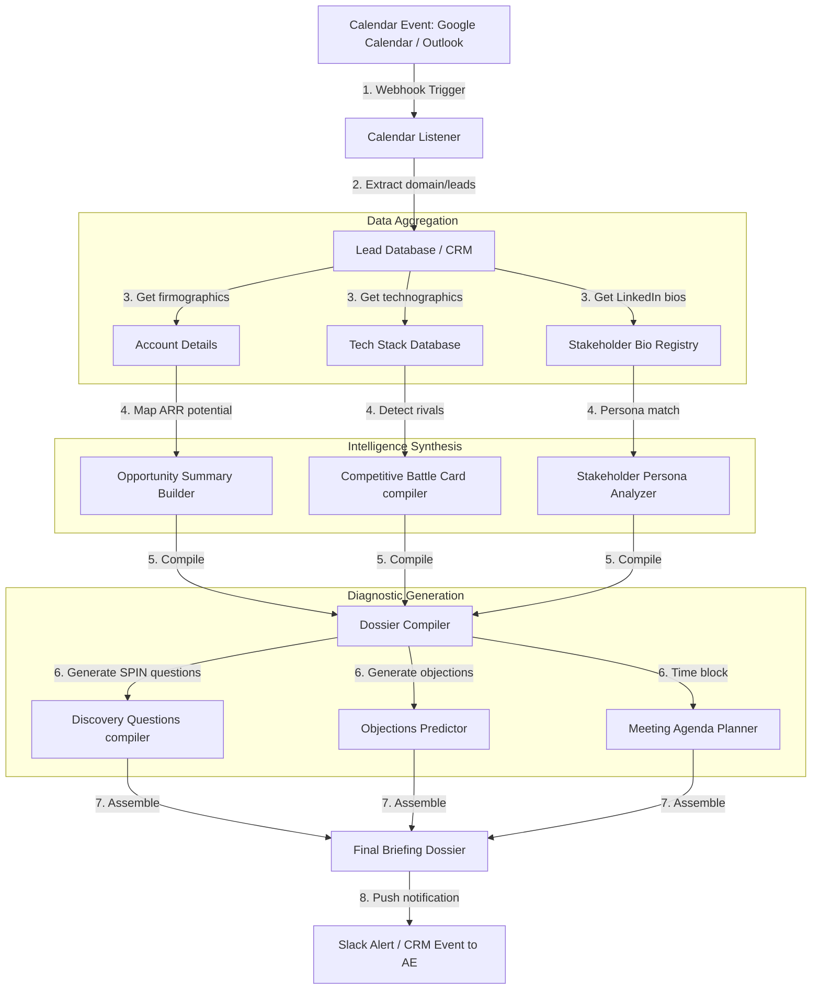

# GTM Architecture - Day 046: AI Meeting Preparation Agent

This document details the sales intelligence pipeline, calendar hooks, and dossier compilation supporting pre-call meeting preparation.

---

## 🔄 Meeting Prep Data Pipeline

The diagram below details the pipeline, showing how calendar events trigger the agent to fetch account details and compile a strategic sales dossier:

---

## ⚙️ Core Architecture Components

1.  **Calendar Listener**: Webhook receiver that listens for incoming sales calendar events (e.g. Google Calendar meetings). Extracts company domains and stakeholder email addresses.
2.  **Account & Technographics Profiler**: Queries internal and external database pools to compile firmographic profiles (size, industry, ARR) and technographic parameters.
3.  **Battle Card Compiler**: Checks prospect technologies against ours to map competitive gaps and highlight why we win.
4.  **Objection Predictor**: Analyzes stakeholder personas (e.g. CEO vs. CTO) and pain points to anticipate objections and compile reframing scripts.
5.  **SPIN Question Planner**: Synthesizes open-ended, diagnostic discovery questions mapped to the prospect's industry and pain points.
