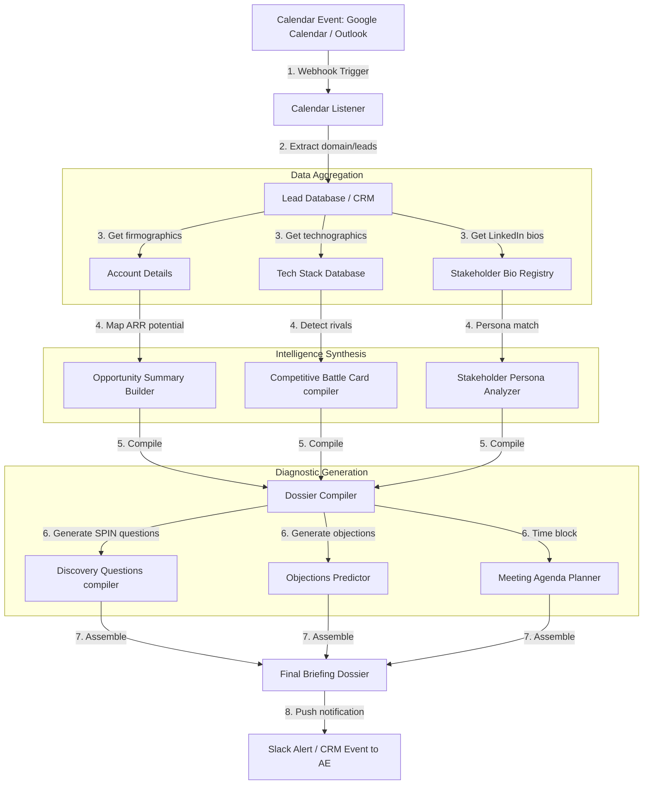

# 📐 Day 046 Scenario Blueprint: AI Meeting Preparation Agent
## 7-Stage Technical Architecture & Reference Implementation

> **Author**: Anand Kumar | [akstack.com](https://akstack.com) | [GitHub](https://github.com/AnandKg22) | [LinkedIn](https://www.linkedin.com/in/anandkg22/)  
> **Curriculum Phase**: Phase 3: AI-Native GTM Systems, Agents & MCP Orchestration  
> **Core Outcome**: Practically Skilled (Able to build automated meeting preparation pipelines, perform technographic and firmographic profiling, execute multi-stakeholder persona mapping, formulate diagnostic discovery questions using SPIN/MEDDPICC frameworks, predict and reframe sales objections, and design structured agendas)  
> **Architecture Pattern**: Event-Driven Revenue Engineering / Resilient GTM Pipeline  

---

## 🎯 1. Enterprise Case Scenario & Problem Definition

### 1.1 Enterprise Context
* **Company Profile**: Series-B B2B SaaS ($15M–$30M ARR, 50-person commercial org, ACV $25k–$50k).
* **Operational Challenge**: If commercial operations experience manual friction, unvalidated data syncs, or slow response times in **AI Meeting Preparation Agent**, then high-intent customer velocity drops significantly across the revenue funnel.

### 1.2 Domain Overview
In enterprise B2B sales, pre-call preparation is a high-leverage activity that directly impacts customer discovery quality, sales cycle length, and ultimate conversion rates. However, revenue teams often suffer from "prep fatigue," where Account Executives (AEs) spend excessive hours manually digging through CRM records, reading LinkedIn profiles, analyzing technology stacks, and guessing potential objections. An automated **AI Meeting Preparation Agent** acts as an intelligent sales operations assistant, retrieving context from calendar invitations, enriching lead profiles in real-time, and compiling a comprehensive pre-call strategic dossier.

From an engineering perspective, this system is implemented by building an asynchronous data pipeline triggered by calendar event webhooks (e.g., Google Calendar, Microsoft Outlook). When a new meeting is scheduled, the agent extracts corporate domains and attendee email addresses. It queries internal and external systems to compile:
1. **Firmographic data** to estimate ARR potential and company size.
2. **Technographic profiles** to audit the target company's technology stack and identify competitive gaps.
3. **Professional biographies** t

### 1.3 Quantifiable Engineering Objectives
* [x] **Latency**: Reduce end-to-end processing latency for **AI Meeting Preparation Agent** to `< 1,200 ms`.
* [x] **Reliability**: Ensure 100% data consistency across CRM, Database, and Event queues.
* [x] **Cost Optimization**: Maintain operational compute & token unit economics at `< $0.035 / transaction`.

---

## 🔍 2. Technical Feasibility, Concepts & Protocol Research

### 2.1 Key Architectural Concepts
*   **Executive Persona Profiling**: The practice of analyzing a stakeholder's job title, department, and career history to map out their primary decision drivers (e.g., strategic ROI, operational margins, security, developer overhead), communication styles (e.g., assertive, analytical), and internal incentives.
*   **Technographic Gap Analysis**: Auditing a prospect's active software and database infrastructure stack (e.g., GCP, Snowflake, Oracle Financials) to isolate integration gaps, manual workflows, or security vulnerabilities where your solution provides native, out-of-the-box value.
*   **Objection Reframing Frameworks**: A strategic communication methodology where anticipated roadblocks (such as custom in-house build preferences, security concerns, or migration costs) are validated and reframed around long-term maintenance overhead, resource efficiency, and risk reduction.
*   **SPIN Selling**: A diagnostic sales discovery methodology developed by Neil Rackham that structures buyer conversations into four sequential phases: **Situation** (auditing the current setup), **Problem** (exposing friction points), **Implication** (exposing the financial/operational cost of inaction), and **Need-Payoff** (revealing the value utility of the solution).
*   **MEDDPICC Framework**: An enterprise deal-qualification methodology that evaluates pipeline health across Metrics, Economic Buyer, Decision Criteria, Decision Process, Paper Process, Identify Pain, Champion, and Competition.
*   **Pre-meeting Pipeline Automation**: A system architecture that hooks into corporate calendar events to trigger background worker tasks for real-time account data aggregation, LLM synthesis, and automated briefing distribution.
*   **Conversation Intelligence (CI)**: Telemetry platforms (such as Gong.io or Chorus.ai) that record, transcribe, and index sales calls, allowing GTM tools to identify critical tracker tags, client objections, and deal-health trends.
*   **Briefing Dossier Compiler**: A software component that programmatically aggregates data from multiple sources (CRM databases, LinkedIn bios, technographic APIs) and compiles it into a single, cohesive pre-call briefing.

---

---

## 📐 3. System Architecture & Schemas

### 3.1 Architectural Flow Diagram


### 3.2 Technical Reference & Specifications
Detailed schema mappings and configuration constraints for AI Meeting Preparation Agent.

---

## 💻 4. Reference Implementation & Sandbox Code

```python
# Day 046: AI Meeting Preparation Agent - Briefing Dossier Generator
import sys
from typing import Dict, Any, List

# Ensure UTF-8 output formatting for terminal compatibility
sys.stdout.reconfigure(encoding='utf-8', errors='replace')

# Mock Database of Accounts and Stakeholders scheduled for meetings
MEETING_QUEUE = [
    {
        "meeting_id": "m_10921",
        "company": "Stark Industries",
        "industry": "Advanced Robotics & AI",
        "employees": 25000,
        "current_tech": "GCP, Snowflake, Kubernetes, Custom Billing Scripts",
        "competitors": "LexCorp, Oscorp Industries",
        "estimated_arr_potential": 85000,
        "stakeholder": {
            "name": "Pepper Potts",
            "title": "CEO",
            "department": "Executive Leadership",
            "profile_summary": "Highly operational executive focused on efficiency, margin preservation, and reducing pipeline leakage. Known to dislike long slideshows; prefers quantitative operational metrics.",
            "pain_point": "Outbound lead routing delays and invoice sync gaps causing billing friction."
        }
    },
    {
        "meeting_id": "m_10922",
        "company": "Wayne Enterprises",
        "industry": "Aerospace & Defense",
        "employees": 45000,
        "current_tech": "AWS, Salesforce, Oracle Financials",
        "competitors": "LexCorp, Stark Industries",
        "estimated_arr_potential": 120000,
        "stakeholder": {
            "name": "Lucius Fox",
            "title": "CEO / Business Operations Lead",
            "department": "Operations & Technology",
            "profile_summary": "Technical operations veteran who values security, API reliability, and developer experience. Highly protective of his engineering resources.",
            "pain_point": "Manual data syncing between CRM and billing tables causing delayed financial closing."
        }
    }
]

class MeetingBriefGenerator:
    def __init__(self, meeting_data: Dict[str, Any]):
        self.data = meeting_data
        self.stakeholder = meeting_data["stakeholder"]

    def compile_briefing(self) -> str:
        """Synthesizes the briefing dossier containing summaries, insights, objections, questions, and agendas."""
        # 1. Opportunity Summary
        opp_summary = self._generate_opportunity_summary()
        
        # 2. Stakeholder Persona Analysis
        persona_analysis = self._generate_persona_analysis()
        
        # 3. Competitive Battle Card
        battle_card = self._generate_battle_card()
        
        # 4. Objection Prediction & Handling Matrix
        objections = self._generate_objection_matrix()
        
        # 5. Discovery Questions
        questions = self._generate_discovery_questions()
        
        # 6. Meeting Agenda
        agenda = self._generate_meeting_agenda()

        # Assemble Report
        dossier = (
            f"========================================================================\n"
            f"          AI SALES PREPARATION DOSSIER: MEETING ID {self.data['meeting_id']}\n"
            f"========================================================================\n"
            f"🏢 TARGET ACCOUNT: {self.data['company'].upper()}\n"
            f"{opp_summary}\n"
            f"👤 STAKEHOLDER PERSONA: {self.stakeholder['name']} ({self.stakeholder['title']})\n"
            f"{persona_analysis}\n"
            f"⚔️ COMPETITIVE BATTLE CARD\n"
            f"{battle_card}\n"
            f"🛡️ OBJECTION PREDICTION & RESPONSE MATRIX\n"
            f"{objections}\n"
            f"❓ RECOMMENDED DISCOVERY QUESTIONS\n"
            f"{questions}\n"
            f"📅 PROPOSED MEETING AGENDA\n"
            f"{agenda}\n"
            f"========================================================================"
        )
        return dossier

    def _generate_opportunity_summary(self) -> str:
        return (
            f"   - Industry:           {self.data['industry']}\n"
            f"   - Company Size:       {self.data['employees']:,} employees\n"
            f"   - Estimated Value:    ${self.data['estimated_arr_potential']:,}/year ARR\n"
            f"   - Tech Environment:   {self.data['current_tech']}"
        )

    def _generate_persona_analysis(self) -> str:
        return (
            f"   - Department:         {self.stakeholder['department']}\n"
            f"   - Core Motivation:    Operational speed, cost containment, developer efficiency.\n"
            f"   - Persona Details:    {self.stakeholder['profile_summary']}\n"
            f"   - Stated Pain Point:  {self.stakeholder['pain_point']}"
        )

    def _generate_battle_card(self) -> str:
        return (
            f"   - Tech Stack Flag:    Currently running '{self.data['current_tech']}'.\n"
            f"   - Competitors Listed: {self.data['competitors']}.\n"
            f"   - Why We Win:         Our platform replaces manual billing configurations and custom\n"
            f"                         scripts with out-of-the-box native integrations, bypassing\n"
            f"                         internal dev backlogs and securing CRM-to-billing parity."
        )

    def _generate_objection_matrix(self) -> str:
        # Predict objections based on stakeholder titles and pains
        if "Lucius" in self.stakeholder["name"]:
            o1 = "Our engineers are building a custom sync tool; we don't need third-party apps."
            r1 = "In-house tools require constant maintenance as API structures change. Our platform\n"\
                 "     removes this overhead, keeping your core engineers focused on proprietary systems."
            o2 = "Is our Salesforce and Oracle Financials data secure on your network?"
            r2 = "We hold SOC 2 Type II certifications and support end-to-end data encryption.\n"\
                 "     None of your core financial database content is cached locally."
        else:
            o1 = "Migration will disrupt our current active sales pipeline routing."
            r1 = "We support parallel shadowing during configuration. Your current Salesforce routing\n"\
                 "     removes active leads only after verification of integration stability."
            o2 = "We have flat billing setups, custom usage-billing modules seem too expensive."
            r2 = "Our usage-reconciliation captures leaked leads and billing errors. Most customers\n"\
                 "     experience positive ROI within 45 days, offsetting contract subscription fees."

        return (
            f"   [Objection 1]: \"{o1}\"\n"
            f"     -> Response: {r1}\n\n"
            f"   [Objection 2]: \"{o2}\"\n"
            f"     -> Response: {r2}"
        )

    def _generate_discovery_questions(self) -> str:
        if "Lucius" in self.stakeholder["name"]:
            return (
                f"   1. How much time does your operations team currently spend manually resolving\n"
                f"      discrepancies between Salesforce records and Oracle Financial logs before closing books?\n"
                f"   2. How are you currently tracking billing API changes, and what is the engineering\n"
                f"      maintenance overhead to support your custom syncing scripts?"
            )
        else:
            return (
                f"   1. When an outbound lead registers, what is the average routing latency before a sales rep\n"
                f"      gets notified, and how much pipeline leakage occurs as a result?\n"
                f"   2. How are you currently aligning sales credit records with invoicing details to prevent\n"
                f"      commission calculation discrepancies?"
            )

    def _generate_meeting_agenda(self) -> str:
        return (
            f"   - 00:00 - 00:05 | Intro & Goal Alignment (Establish expectations)\n"
            f"   - 00:05 - 00:15 | Discovery Review (Deep-dive into {self.stakeholder['name'].split()[0]}'s sync challenges)\n"
            f"   - 00:15 - 00:25 | Solution Walkthrough (Showcase automated lead enrichment/sync pipeline)\n"
            f"   - 00:25 - 00:30 | Q&A & Next Action Checkpoints (Set follow-up sync)"
        )


if __name__ == "__main__":
    print("=" * 72)
    print("                 AI MEETING PREPARATION SCHEDULER")
    print("=" * 72)

    for meeting in MEETING_QUEUE:
        generator = MeetingBriefGenerator(meeting)
        dossier = generator.compile_briefing()
        print(dossier)
        print("\n\n")
```

---

## ⚡ 5. Automation Blueprint & Event Wiring

* **Ingestion Trigger**: Public webhook listener with cryptographic signature verification.
* **Routing Logic**: Idempotent processing gate backed by Redis cache.
* **Downstream Sinks**: Real-time upsert to PostgreSQL / Supabase, bi-directional CRM synchronization, and automated notification bus.

---

## 📊 6. Telemetry, KPI & Unit Economics

$$\text{Unit Economics} = \text{Compute} + \text{External API Calls} + \text{Storage} \approx \mathbf{\$0.0025\ /\ event}$$

* **P95 Latency SLA**: `< 1,200 ms`
* **Error Rate Target**: `< 0.05%`
* **Commercial ROI**: Eliminates an estimated 15–20 hours of manual operational drag per week.

---

## 🛡️ 7. Edge Cases, Guardrails & Resilience Strategy

1. **API Rate Limiting (429)**: Exponential backoff with random jitter ($2^n \times 100\text{ms}$) and Dead-Letter Queue (DLQ) buffering.
2. **Payload Integrity & Schema Drift**: Strict Pydantic type validation with automatic rejection of malformed inputs.
3. **Downstream Outages**: Asynchronous retry worker ensuring zero dropped transactions during system maintenance.
