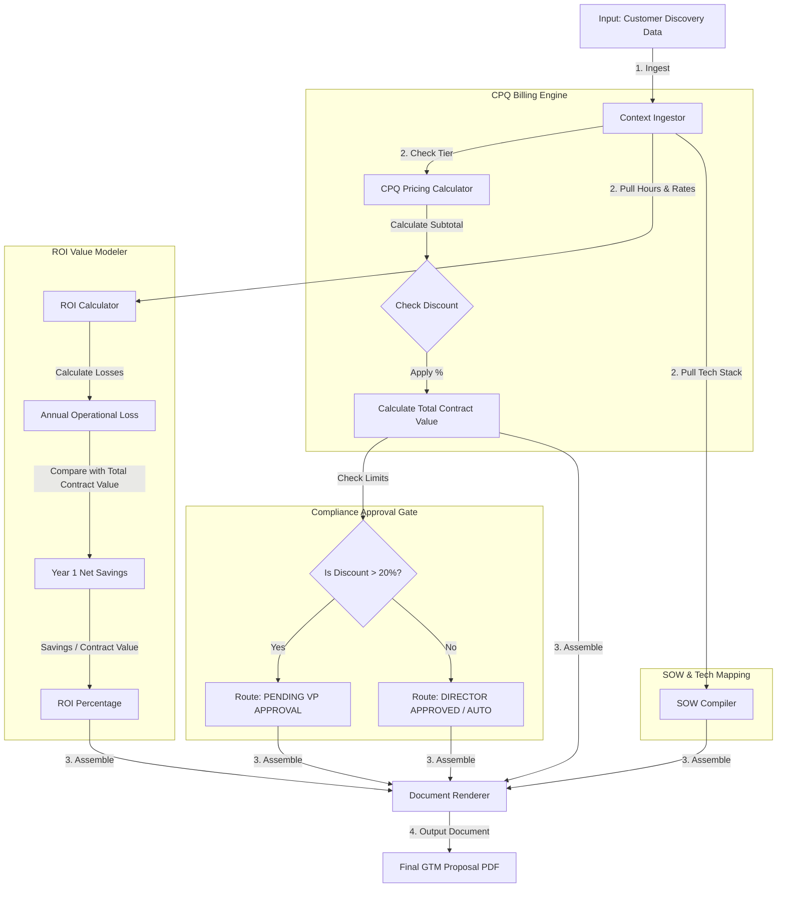

# GTM Architecture - Day 047: AI Proposal Generator

This document details the proposal compiler pipelines, pricing engines, and discount compliance routing supporting proposal generation.

---

## 🔄 Proposal Generation Pipeline

The diagram below details the pipeline, showing how customer variables are processed to compile a structured, compliant sales proposal:

---

## ⚙️ Core Architecture Components

1.  **Context Ingestor**: Reads raw parameters (company name, size, technology stack, pain points, wasted hours, labor rate, discount) from the CRM opportunity file.
2.  **CPQ Pricing Calculator**: Maps segment tiers (SMB vs MM vs Enterprise) to baseline software licensing and implementation setup fee matrices, applying discounts.
3.  **ROI Value Modeler**: Compiles the customer's cost of pain and savings percentages, providing a quantitative value argument for sales calls.
4.  **SOW Compiler**: Dynamically writes phased integration steps based on the customer's technology stack.
5.  **Approval Route Controller**: Evaluates discount compliance levels, routing the proposal's status based on discount thresholds.
6.  **Document Renderer**: Combines all sections and formats them as markdown files, ready for PDF compilation.
