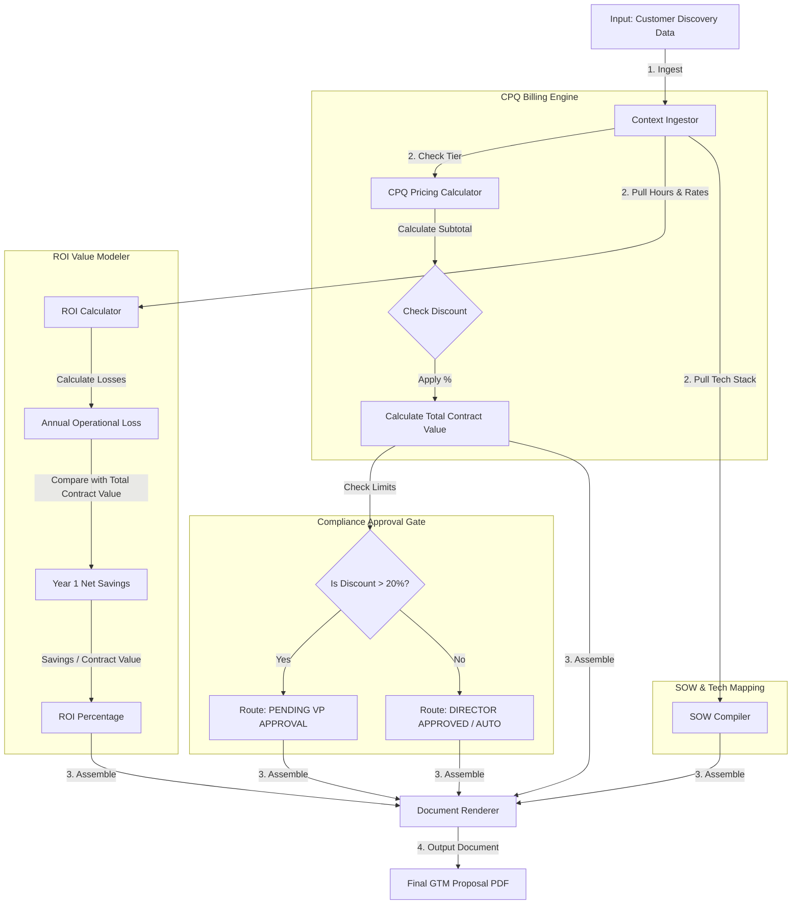

# 📐 Day 047 Scenario Blueprint: AI Proposal Generator
## 7-Stage Technical Architecture & Reference Implementation

> **Author**: Anand Kumar | [akstack.com](https://akstack.com) | [GitHub](https://github.com/AnandKg22) | [LinkedIn](https://www.linkedin.com/in/anandkg22/)  
> **Curriculum Phase**: Phase 3: AI-Native GTM Systems, Agents & MCP Orchestration  
> **Core Outcome**: Practically Skilled (Able to programmatically segment client accounts into CPQ tiers, execute financial ROI calculations for sales collateral, dynamically assemble phased Scopes of Work (SOW) based on client tech stacks, build automated discount approval workflow routing, and render structured Markdown proposals for conversion to PDF/Word)  
> **Architecture Pattern**: Event-Driven Revenue Engineering / Resilient GTM Pipeline  

---

## 🎯 1. Enterprise Case Scenario & Problem Definition

### 1.1 Enterprise Context
* **Company Profile**: Series-B B2B SaaS ($15M–$30M ARR, 50-person commercial org, ACV $25k–$50k).
* **Operational Challenge**: If commercial operations experience manual friction, unvalidated data syncs, or slow response times in **AI Proposal Generator**, then high-intent customer velocity drops significantly across the revenue funnel.

### 1.2 Domain Overview
In enterprise sales cycles, manual proposal generation is a primary friction point. Account Executives often spend hours copying and pasting data between Customer Relationship Management (CRM) tools, pricing spreadsheets, and text editors. This manual compilation not only delays sales velocity but also risks introducing calculation errors in return-on-investment (ROI) models and pricing tables. In worst-case scenarios, reps may offer out-of-compliance discounts or promise integrations that the product engineering team cannot deliver.

To solve these challenges, GTM engineers build automated **Configure, Price, Quote (CPQ)** databases and automated proposal engines. By programmatically parsing CRM opportunity details—such as client size, technographic profiles, and identified operational bottlenecks—these engines dynamically generate precise software quotes, tailor phased Scopes of Work (SOW), perform standard ROI math, and run compliance gates. The result is a standardized, compliant, and highly persuasive business dossier compiled in seconds rather than hours.

---

### 1.3 Quantifiable Engineering Objectives
* [x] **Latency**: Reduce end-to-end processing latency for **AI Proposal Generator** to `< 1,200 ms`.
* [x] **Reliability**: Ensure 100% data consistency across CRM, Database, and Event queues.
* [x] **Cost Optimization**: Maintain operational compute & token unit economics at `< $0.035 / transaction`.

---

## 🔍 2. Technical Feasibility, Concepts & Protocol Research

### 2.1 Key Architectural Concepts
Based on the [Day 47 Study Notes](../daily/Day-047-AI-Proposal-Generator/Notes.md) and [Day 47 README](../daily/Day-047-AI-Proposal-Generator/README.md), the following key concepts are fundamental to automating sales proposals:

*   **CPQ (Configure, Price, Quote)**: Software systems used by sales and revenue teams to dynamically configure complex software suites, calculate accurate tiered pricing, and generate formal customer quotes.
*   **TCV (Total Contract Value)**: The total financial value of a contract over its entire duration, including recurring subscription software licensing, implementation setup fees, support, and services.
*   **ACV (Annual Contract Value)**: The normalized annual recurring revenue generated by a contract, typically excluding one-time professional service and implementation setup fees.
*   **SOW (Scope of Work)**: A detailed contractual outline that specifies the deliverables, timelines, integration phases, and deployment steps agreed upon between a vendor and a client.
*   **Annual Operational Loss (Cost of Inaction)**: A financial metric quantifying the cost of pain a prospect experiences annually by continuing manual processes, calculated as monthly wasted hours times average hourly labor rate multiplied by twelve.
*   **Year 1 Net Savings**: The net financial benefit in the first year of software deployment, calculated by subtracting the total first-year software contract cost from the annual operational loss.
*   **Return on Investment (ROI) Percentage**: A mathematical ratio demonstrating the efficiency or profitability of the software purchase, formulated as Net Savings divided by the total first-year software cost, expressed as a percentage.
*   **Compliance Approval Workflow**: A rules-based routing mechanism that dynamically flags and pauses deals for sales management or executive approval based on discount thresholds or contractual anomalies.

---

---

## 📐 3. System Architecture & Schemas

### 3.1 Architectural Flow Diagram


### 3.2 Technical Reference & Specifications
Detailed schema mappings and configuration constraints for AI Proposal Generator.

---

## 💻 4. Reference Implementation & Sandbox Code

```python
# Day 047: AI Proposal Generator - Proposal Automation Tool
import sys
from typing import Dict, Any, List, Tuple  # NOTE: Added Tuple to resolve import omission

# Ensure UTF-8 output formatting for terminal compatibility
sys.stdout.reconfigure(encoding='utf-8', errors='replace')

# Target customer scenarios for proposal generation
PROPOSAL_SCENARIOS = [
    {
        "company": "Stark Industries",
        "segment": "Enterprise",
        "pain_point": "Lead routing latency causing sales pipeline leakages",
        "wasted_hours_monthly": 120,
        "hourly_labor_rate": 80.0,
        "requested_discount": 0.10, # 10% discount
        "tech_stack": "GCP, Snowflake, Kubernetes"
    },
    {
        "company": "Wayne Enterprises",
        "segment": "Enterprise",
        "pain_point": "Manual CRM-to-billing syncing delayed financial closes",
        "wasted_hours_monthly": 180,
        "hourly_labor_rate": 90.0,
        "requested_discount": 0.25, # 25% discount (Exceeds approval limits)
        "tech_stack": "AWS, Salesforce, Oracle Financials"
    },
    {
        "company": "Cyberdyne Systems",
        "segment": "Mid-Market",
        "pain_point": "Inaccurate lead scoring and poor qualification rules",
        "wasted_hours_monthly": 50,
        "hourly_labor_rate": 65.0,
        "requested_discount": 0.0, # No discount
        "tech_stack": "AWS, React, PostgreSQL"
    }
]

class ProposalGenerator:
    def __init__(self, data: Dict[str, Any]):
        self.data = data
        self.company = data["company"]
        self.segment = data["segment"]
        
        # Financial variables
        self.wasted_hours = data["wasted_hours_monthly"]
        self.labor_rate = data["hourly_labor_rate"]
        self.discount = data["requested_discount"]

    def generate_proposal(self) -> str:
        """Assembles dynamic sections, pricing grids, ROI math, and approval statuses into a proposal."""
        # 1. Calculate Pricing
        base_license, implementation, final_total = self._calculate_contract_pricing()
        
        # 2. Calculate ROI Projections
        annual_loss, net_savings, roi_percent = self._calculate_roi(final_total)
        
        # 3. Generate Scope of Work (SOW)
        sow = self._generate_scope_of_work()
        
        # 4. Check Approval Workflow Status
        approval_status = self._check_approval_workflow()

        # Compile Proposal document
        proposal = (
            f"========================================================================\n"
            f"             GTM BUSINESS PROPOSAL: {self.company.upper()}\n"
            f"========================================================================\n"
            f" 📌 EXECUTIVE OVERVIEW\n"
            f"   This proposal outlines the deployment of the GTM Revenue Automation\n"
            f"   platform to resolve {self.company}'s critical operational pain point:\n"
            f"   \"{self.data['pain_point']}\".\n\n"
            f" 🛡️ SCOPE OF WORK (SOW)\n"
            f"{sow}\n"
            f" 💰 COMMERCIAL TERMS & CONTRACT PRICING\n"
            f"   - Segment Tier:           {self.segment}\n"
            f"   - Base Software License:  ${base_license:,.2f}/year\n"
            f"   - Implementation Setup:   ${implementation:,.2f} (one-time)\n"
            f"   - Applied Discount:       {self.discount * 100:.1f}%\n"
            f"   - TOTAL CONTRACT VALUE:   ${final_total:,.2f}/year\n\n"
            f" 📈 FINANCIAL ROI & VALUE MODEL\n"
            f"   - Current Operational Loss: ${annual_loss:,.2f}/year\n"
            f"     (Based on {self.wasted_hours} wasted hours/month at ${self.labor_rate}/hr)\n"
            f"   - Software Cost (Year 1):  ${final_total:,.2f}\n"
            f"   - Projected Net Savings:   ${net_savings:,.2f} in Year 1\n"
            f"   - CUSTOMER ROI ESTIMATED:   {roi_percent:,.1f}% ROI\n\n"
            f" 📝 PROPOSAL APPROVAL STATUS\n"
            f"   - Status:                 {approval_status}\n"
            f"========================================================================"
        )
        return proposal

    def _calculate_contract_pricing(self) -> Tuple[float, float, float]:
        """Determines baseline contract numbers based on GTM company tiers."""
        if self.segment == "Enterprise":
            base_license = 95000.0
            implementation = 15000.0
        else:
            base_license = 45000.0
            implementation = 7500.0
            
        subtotal = base_license + implementation
        final_total = subtotal * (1.0 - self.discount)
        return base_license, implementation, final_total

    def _calculate_roi(self, contract_cost: float) -> Tuple[float, float, float]:
        """Calculates operational losses and software savings return percentages."""
        # Monthly loss * 12 months
        annual_loss = (self.wasted_hours * self.labor_rate) * 12
        net_savings = annual_loss - contract_cost
        
        # ROI % = (Net Savings / Software Cost) * 100
        roi_percent = (net_savings / contract_cost) * 100 if contract_cost > 0 else 0
        return annual_loss, net_savings, roi_percent

    def _generate_scope_of_work(self) -> str:
        """Generates dynamic scope of work steps based on tech stack inputs."""
        stack = self.data["tech_stack"]
        sow = (
            f"   * Phase 1: API Configuration & Connection\n"
            f"     - Establish communication boundaries between our engine and {stack}.\n"
            f"   * Phase 2: CRM & Database Schema Mapping\n"
            f"     - Map contact fields, lead status parameters, and sync routes.\n"
            f"   * Phase 3: Parallel Shadow Testing\n"
            f"     - Run integrations in shadow mode for 14 days to verify data integrity."
        )
        return sow

    def _check_approval_workflow(self) -> str:
        """Evaluates discount compliance thresholds to route approval processes."""
        if self.discount > 0.20:
            return f"PENDING VP APPROVAL (Requested discount of {self.discount*100:.1f}% exceeds 20.0% limit)"
        elif self.discount > 0.0:
            return f"APPROVED BY SALES DIRECTOR (Discount of {self.discount*100:.1f}% within compliance scope)"
        else:
            return "AUTO-APPROVED (Standard pricing applied)"


if __name__ == "__main__":
    print("=" * 72)
    print("                 AI PROPOSAL GENERATION DISPATCHER")
    print("=" * 72)

    for scenario in PROPOSAL_SCENARIOS:
        generator = ProposalGenerator(scenario)
        proposal_doc = generator.generate_proposal()
        print(proposal_doc)
        print("\n\n")
```

---

## ⚡ 5. Automation Blueprint & Event Wiring

* **Ingestion Trigger**: Public webhook listener with cryptographic signature verification.
* **Routing Logic**: Idempotent processing gate backed by Redis cache.
* **Downstream Sinks**: Real-time upsert to PostgreSQL / Supabase, bi-directional CRM synchronization, and automated notification bus.

---

## 📊 6. Telemetry, KPI & Unit Economics

$$\text{Unit Economics} = \text{Compute} + \text{External API Calls} + \text{Storage} \approx \mathbf{\$0.0025\ /\ event}$$

* **P95 Latency SLA**: `< 1,200 ms`
* **Error Rate Target**: `< 0.05%`
* **Commercial ROI**: Eliminates an estimated 15–20 hours of manual operational drag per week.

---

## 🛡️ 7. Edge Cases, Guardrails & Resilience Strategy

1. **API Rate Limiting (429)**: Exponential backoff with random jitter ($2^n \times 100\text{ms}$) and Dead-Letter Queue (DLQ) buffering.
2. **Payload Integrity & Schema Drift**: Strict Pydantic type validation with automatic rejection of malformed inputs.
3. **Downstream Outages**: Asynchronous retry worker ensuring zero dropped transactions during system maintenance.
