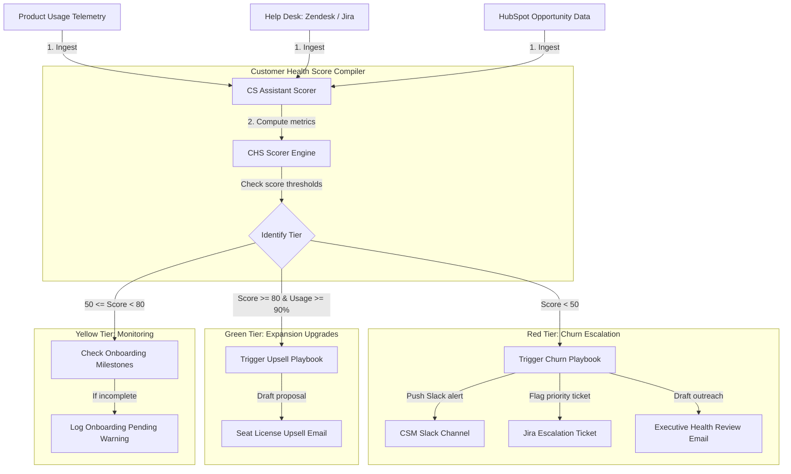

# GTM Architecture - Day 048: AI Customer Success Agent

This document details the account health auditing pipeline, metrics databases, and CSM escalation hooks supporting retention engineering.

---

## 🔄 CS Portfolio Auditing Pipeline

The diagram below details the pipeline, showing how telemetry data is calculated to compile customer health rankings and trigger mitigation processes:

---

## ⚙️ Core Architecture Components

1.  **Telemetry Ingestor**: Connects to product databases to pull active seat utilization, login counts, and api credit balances.
2.  **Help Desk Listener**: Queries ticket APIs (e.g. Zendesk) to fetch open customer tickets and calculate sentiment penalties.
3.  **CHS Scorer Engine**: Calculates a 100-point health score by weighting adoption, onboarding progress, and support tickets.
4.  **Escalation Router**: Evaluates health tiers, triggering CSM warning notifications to Slack and prioritizing support queues.
5.  **Dossier Email Writer**: Drafts customized outreach templates for CSMs (addressing tickets for at-risk accounts or pitching upgrades for healthy accounts).
