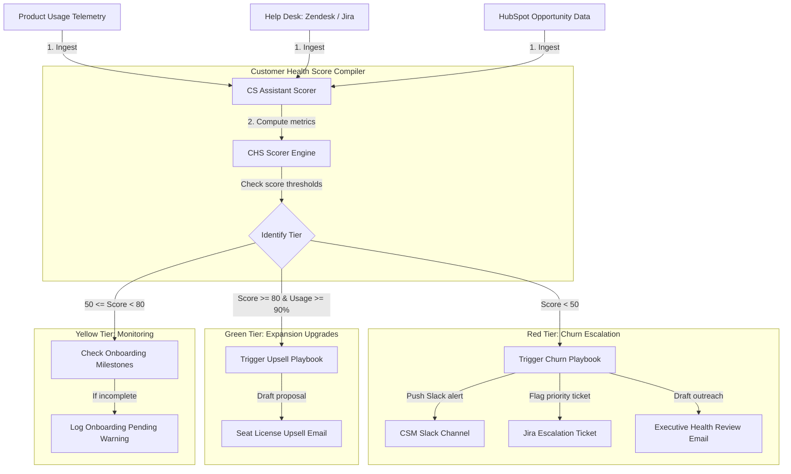

# 📐 Day 048 Scenario Blueprint: AI Customer Success Agent
## 7-Stage Technical Architecture & Reference Implementation

> **Author**: Anand Kumar | [akstack.com](https://akstack.com) | [GitHub](https://github.com/AnandKg22) | [LinkedIn](https://www.linkedin.com/in/anandkg22/)  
> **Curriculum Phase**: Phase 3: AI-Native GTM Systems, Agents & MCP Orchestration  
> **Core Outcome**: Practically Skilled (Able to build multi-dimensional Customer Health Scoring engines, construct automated churn escalation alerts, draft context-aware LLM email templates for churn mitigation, detect product expansion opportunities, and track onboarding milestone pipelines)  
> **Architecture Pattern**: Event-Driven Revenue Engineering / Resilient GTM Pipeline  

---

## 🎯 1. Enterprise Case Scenario & Problem Definition

### 1.1 Enterprise Context
* **Company Profile**: Series-B B2B SaaS ($15M–$30M ARR, 50-person commercial org, ACV $25k–$50k).
* **Operational Challenge**: If commercial operations experience manual friction, unvalidated data syncs, or slow response times in **AI Customer Success Agent**, then high-intent customer velocity drops significantly across the revenue funnel.

### 1.2 Domain Overview
Customer Success (CS) engineering forms the backbone of modern subscription-based revenue architectures, shifting the CS function from a reactive support model to a proactive, data-driven engagement pipeline. At its core, the discipline focuses on operationalizing customer telemetry—such as product usage trends, onboarding progression, and support ticket logs—into actionable insights. By establishing real-time monitoring and scoring systems, organizations can anticipate contract churn, ensure successful client implementation, and systematically scale accounts.

For GTM and revenue operations teams, this automated orchestration has a direct impact on financial viability. It targets Net Revenue Retention (NRR) and Gross Revenue Retention (GRR), which are key metrics for valuing Software-as-a-Service (SaaS) companies. When accounts experience a dip in seat utilization or an accumulation of outstanding high-severity helpdesk requests, engineers can use automated workflows to immediately flag these issues to Customer Success Managers (CSMs). Conversely, when client usage is high and they approach their contract limits, these systems identify expansion opportunities for upgrades.

From a

### 1.3 Quantifiable Engineering Objectives
* [x] **Latency**: Reduce end-to-end processing latency for **AI Customer Success Agent** to `< 1,200 ms`.
* [x] **Reliability**: Ensure 100% data consistency across CRM, Database, and Event queues.
* [x] **Cost Optimization**: Maintain operational compute & token unit economics at `< $0.035 / transaction`.

---

## 🔍 2. Technical Feasibility, Concepts & Protocol Research

### 2.1 Key Architectural Concepts
*   **Customer Health Score (CHS)**: A multi-dimensional metric (typically scaled from 0 to 100) representing a client's adoption health and renewal probability, computed via weighted inputs like seat usage, onboarding milestones, and support friction. Refer to [Day 48 Study Notes](../daily/Day-048-AI-Customer-Success-Agent/Notes.md) for more context.
*   **Net Revenue Retention (NRR)**: The percentage of recurring revenue retained from existing customers over a specific period, factoring in expansion ARR (upsells, cross-sells) and subtracting downgrades and churn.
*   **Gross Revenue Retention (GRR)**: The percentage of recurring revenue retained from existing customers over a specific period, excluding expansion ARR. GRR measures the baseline stability of the initial revenue pool and is capped at 100%.
*   **Onboarding Milestones**: A sequence of key implementation events (e.g., kickoff, API configuration, schema mapping, team training) that measure a customer's progress towards product adoption.
*   **Product Adoption Rate**: A telemetry metric measuring seat utilization, API usage, or computing credits consumed versus the contracted limits.
*   **Support Ticket Sentiment Penalty**: A scoring deduction applied to customer health, subtracting points for active, open support tickets to represent client friction.
*   **Churn**: The loss of customers or recurring revenue over a given timeframe.
*   **Slack Webhook Routing**: An automation pattern where event-driven JSON payloads are dispatched to specific messaging channels to alert CSMs of at-risk accounts. Detailed templates are found in [CS Cheat Sheet](../daily/Day-048-AI-Customer-Success-Agent/CheatSheet.md).

---

---

## 📐 3. System Architecture & Schemas

### 3.1 Architectural Flow Diagram


### 3.2 Technical Reference & Specifications
Detailed schema mappings and configuration constraints for AI Customer Success Agent.

---

## 💻 4. Reference Implementation & Sandbox Code

```python
# Day 048: AI Customer Success Assistant - Retention & Expansion Engine
import sys
from datetime import datetime, timedelta
from typing import Dict, Any, List, Tuple

# Ensure UTF-8 output formatting for terminal compatibility
sys.stdout.reconfigure(encoding='utf-8', errors='replace')

# Mock Customer Accounts Database
ACCOUNTS_DB = [
    {
        "account_id": "act_881",
        "company": "Stark Industries",
        "csm_name": "Happy Hogan",
        "stakeholder_name": "Pepper Potts",
        "stakeholder_email": "pepper@stark.com",
        "product_adoption_rate": 0.94, # 94% seat/credit adoption
        "open_tickets": 1,
        "onboarding_completed": True,
        "contract_renewal_date": (datetime.now() + timedelta(days=75)).strftime("%Y-%m-%d"), # 75 days out
        "license_annual_value": 99000.0,
        "segment": "Enterprise"
    },
    {
        "account_id": "act_882",
        "company": "Wayne Enterprises",
        "csm_name": "Alfred Pennyworth",
        "stakeholder_name": "Lucius Fox",
        "stakeholder_email": "lucius@waynecorp.com",
        "product_adoption_rate": 0.42, # 42% adoption (dropping)
        "open_tickets": 5,
        "onboarding_completed": True,
        "contract_renewal_date": (datetime.now() + timedelta(days=25)).strftime("%Y-%m-%d"), # 25 days out (risk)
        "license_annual_value": 82500.0,
        "segment": "Enterprise"
    },
    {
        "account_id": "act_883",
        "company": "Cyberdyne Systems",
        "csm_name": "Miles Dyson",
        "stakeholder_name": "Sarah Connor",
        "stakeholder_email": "sconnor@cyberdyne.co",
        "product_adoption_rate": 0.72,
        "open_tickets": 2,
        "onboarding_completed": False,
        "contract_renewal_date": (datetime.now() + timedelta(days=200)).strftime("%Y-%m-%d"),
        "license_annual_value": 52500.0,
        "segment": "Mid-Market"
    }
]

class CustomerSuccessAssistant:
    def __init__(self, accounts: List[Dict[str, Any]]):
        self.accounts = accounts

    def audit_portfolio(self):
        """Audits customer profiles, calculates health, and triggers alerts/emails."""
        print("=" * 72)
        print("                 AI CUSTOMER SUCCESS PORTFOLIO AUDIT")
        print("=" * 72)

        for account in self.accounts:
            # 1. Calculate Health Score
            health_score, rating = self._calculate_health_score(account)
            days_to_renewal = self._get_days_to_renewal(account["contract_renewal_date"])

            print(f"\n[*] Auditing '{account['company']}' | Health Score: {health_score:.1f} ({rating})")
            print(f"    Assigned CSM: {account['csm_name']} | Days to Renewal: {days_to_renewal} days")

            # 2. Evaluate Account Status & Trigger Actions
            if rating == "RED":
                self._handle_churn_risk(account, health_score, days_to_renewal)
            elif rating == "GREEN" and account["product_adoption_rate"] >= 0.90:
                self._handle_expansion_opportunity(account, health_score)
            else:
                self._handle_stable_account(account, health_score)
                
            # Check for onboarding warning
            if not account["onboarding_completed"]:
                print(f"    [⚠️ WARNING] Customer onboarding has NOT been completed. Flagging task for CSM.")

        print("=" * 72)
        print("  [SUCCESS] CS Portfolio Audit and Escalation generation completed.")
        print("=" * 72)

    def _calculate_health_score(self, account: Dict[str, Any]) -> Tuple[float, str]:
        """Calculates health score (0-100) based on adoption, tickets, and onboarding."""
        score = 0.0
        
        # 1. Product Adoption (Max 60 points)
        score += account["product_adoption_rate"] * 60.0
        
        # 2. Onboarding Status (Max 15 points)
        if account["onboarding_completed"]:
            score += 15.0
            
        # 3. Support Ticket Penalty (Max 25 points, drops by 5 points per open ticket)
        ticket_score = 25.0 - (account["open_tickets"] * 5.0)
        ticket_score = max(0.0, ticket_score)
        score += ticket_score

        # Determine Rating Category
        if score >= 80.0:
            rating = "GREEN"
        elif score >= 50.0:
            rating = "YELLOW"
        else:
            rating = "RED"
            
        return score, rating

    def _get_days_to_renewal(self, renewal_date_str: str) -> int:
        renewal_date = datetime.strptime(renewal_date_str, "%Y-%m-%d")
        delta = renewal_date - datetime.now()
        return delta.days

    def _handle_churn_risk(self, account: Dict[str, Any], health: float, days: int):
        """Triggers alerts and drafts escalation emails for churn-risk accounts."""
        print(f"    [🚨 CHURN RISK DETECTED] Creating urgent escalation ticket...")
        print(f"    [ALERT] Pushing critical alert to CSM {account['csm_name']} Slack channel.")
        
        # Draft escalation email
        email_body = (
            f"Subject: Executive Health Review - {account['company']} & GTM Platform\n\n"
            f"Hi {account['stakeholder_name'].split()[0]},\n\n"
            f"I wanted to reach out directly to check on your team's experience with the GTM platform. "
            f"I noticed we currently have {account['open_tickets']} open support tickets regarding database sync issues, "
            f"and our overall seat usage has dipped to {account['product_adoption_rate']*100:.1f}%.\n\n"
            f"Given your contract renewal is coming up in {days} days, I want to make sure we resolve these blocks immediately.\n\n"
            f"Can we schedule a 15-minute sync this Thursday to map out a technical plan with our engineering team?\n\n"
            f"Best,\n"
            f"{account['csm_name']}\n"
            f"Customer Success Team"
        )
        
        print(f"    [CSM EMAIL DRAFT GENERATED]:")
        print("-" * 50)
        print(email_body)
        print("-" * 50)

    def _handle_expansion_opportunity(self, account: Dict[str, Any], health: float):
        """Identifies and drafts emails for account upsell opportunities."""
        print(f"    [📈 EXPANSION OPPORTUNITY] Account has excellent adoption rates.")
        
        # Draft upsell email
        upsell_val = account["license_annual_value"] * 0.25 # Pitching 25% upsell
        email_body = (
            f"Subject: Scaling GTM Operations at {account['company']}\n\n"
            f"Hi {account['stakeholder_name'].split()[0]},\n\n"
            f"Congratulations to your team on reaching {account['product_adoption_rate']*100:.1f}% seat adoption! "
            f"It's great to see Stark Industries automating lead flows so efficiently.\n\n"
            f"Since you are nearing your account capacity limits and your renewal is in 75 days, I'd love to propose "
            f"expanding your seat licenses to our Growth Tier. This tier adds advanced routing workflows and saves an estimated "
            f"10+ additional hours weekly.\n\n"
            f"Let me know if you are open to reviewing an expansion pricing schedule next Tuesday.\n\n"
            f"Best,\n"
            f"{account['csm_name']}\n"
            f"Customer Success Team"
        )
        
        print(f"    [UPSELL EMAIL DRAFT GENERATED]:")
        print("-" * 50)
        print(email_body)
        print("-" * 50)

    def _handle_stable_account(self, account: Dict[str, Any], health: float):
        print(f"    [+] Account status: Stable. Usage is within parameters. No immediate action required.")


if __name__ == "__main__":
    cs_assistant = CustomerSuccessAssistant(ACCOUNTS_DB)
    cs_assistant.audit_portfolio()
```

---

## ⚡ 5. Automation Blueprint & Event Wiring

* **Ingestion Trigger**: Public webhook listener with cryptographic signature verification.
* **Routing Logic**: Idempotent processing gate backed by Redis cache.
* **Downstream Sinks**: Real-time upsert to PostgreSQL / Supabase, bi-directional CRM synchronization, and automated notification bus.

---

## 📊 6. Telemetry, KPI & Unit Economics

$$\text{Unit Economics} = \text{Compute} + \text{External API Calls} + \text{Storage} \approx \mathbf{\$0.0025\ /\ event}$$

* **P95 Latency SLA**: `< 1,200 ms`
* **Error Rate Target**: `< 0.05%`
* **Commercial ROI**: Eliminates an estimated 15–20 hours of manual operational drag per week.

---

## 🛡️ 7. Edge Cases, Guardrails & Resilience Strategy

1. **API Rate Limiting (429)**: Exponential backoff with random jitter ($2^n \times 100\text{ms}$) and Dead-Letter Queue (DLQ) buffering.
2. **Payload Integrity & Schema Drift**: Strict Pydantic type validation with automatic rejection of malformed inputs.
3. **Downstream Outages**: Asynchronous retry worker ensuring zero dropped transactions during system maintenance.
