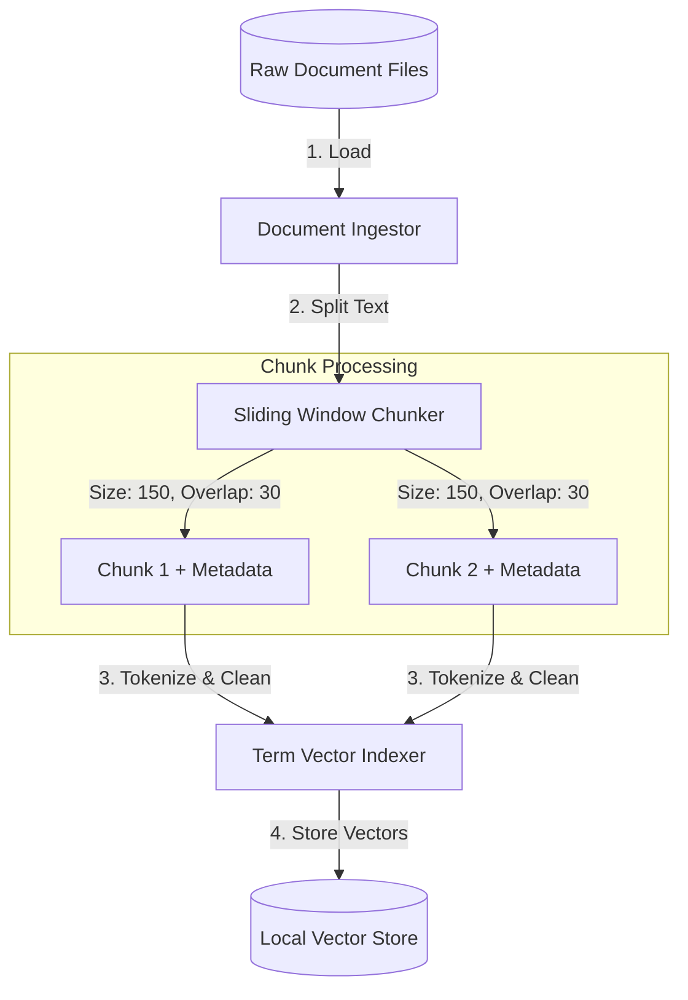
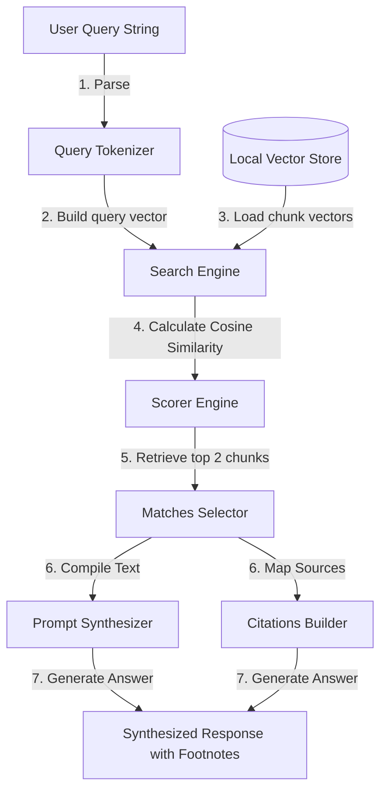

# GTM Architecture - Day 049: AI Knowledge Assistant

This document details the RAG architecture, sliding window text splitters, and vector similarity calculators supporting document retrieval.

---

## 🔄 RAG Indexing & Retrieval Pipelines

The diagrams below outline the indexing pipeline (offline document ingestion) and the retrieval pipeline (live query search):

### 1. Ingestion & Indexing Pipeline (Offline)

### 2. Query & Retrieval Pipeline (Live)

---

## ⚙️ Core Retrieval Components

1.  **Sliding Window Chunker**: Splits long documents into overlapping character/token blocks to prevent losing context at chunk boundaries.
2.  **Query Tokenizer**: Cleans input strings, filters out stop words, and builds term vectors.
3.  **Vector Store**: Database holding document chunks, metadata (source titles, chunk indices), and term-frequency vectors.
4.  **Cosine Similarity Scorer**: Calculates vector alignment angles, ranking chunks by relevance.
5.  **Prompt Synthesizer**: Combines retrieved chunks into a prompt template, forcing the LLM to base its answers on the provided context.
