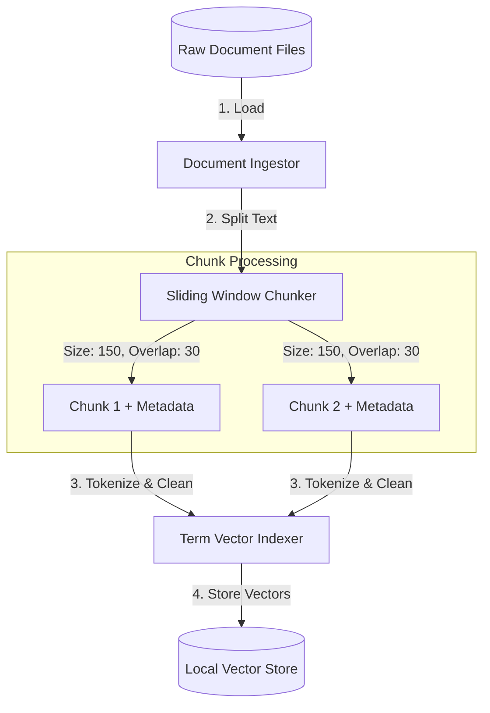

# 📐 Day 049 Scenario Blueprint: AI Knowledge Assistant
## 7-Stage Technical Architecture & Reference Implementation

> **Author**: Anand Kumar | [akstack.com](https://akstack.com) | [GitHub](https://github.com/AnandKg22) | [LinkedIn](https://www.linkedin.com/in/anandkg22/)  
> **Curriculum Phase**: Phase 3: AI-Native GTM Systems, Agents & MCP Orchestration  
> **Core Outcome**: Practically Skilled (Able to parse and index raw corporate documentation, implement character-based sliding window text chunking, construct term-frequency vectors from tokenized text, execute semantic vector space queries via pure Python cosine similarity calculations, design hallucination control threshold gates, and generate context-derived answers with clear source attribution)  
> **Architecture Pattern**: Event-Driven Revenue Engineering / Resilient GTM Pipeline  

---

## 🎯 1. Enterprise Case Scenario & Problem Definition

### 1.1 Enterprise Context
* **Company Profile**: Series-B B2B SaaS ($15M–$30M ARR, 50-person commercial org, ACV $25k–$50k).
* **Operational Challenge**: If commercial operations experience manual friction, unvalidated data syncs, or slow response times in **AI Knowledge Assistant**, then high-intent customer velocity drops significantly across the revenue funnel.

### 1.2 Domain Overview
In modern Go-To-Market (GTM) engineering, access to internal corporate documentation is critical for aligning sales, support, and security compliance teams. Revenue operations frequently process massive, disparate information sources—such as security policy manuals, API guides, and complex billing structures. Traditional search engines fail to locate relevant data because they rely on exact keyword matches. When sales representatives require quick compliance answers to complete Request for Proposals (RFPs) or customer questionnaires, keyword searches often return too many irrelevant files or miss conceptually related entries entirely.

To solve this problem, engineers deploy **Retrieval-Augmented Generation (RAG)** systems. RAG is a pattern where query-specific, factual documents are retrieved from a vector database and injected directly into an LLM's prompt context, forcing the model to generate responses based on verified information rather than its training data. The pipeline begins with document ingestion and a sliding window chunking strategy that splits long texts into small, overlapping blocks. These blocks are tokenized, cleaned, and mathematically indexed. When a query is 

### 1.3 Quantifiable Engineering Objectives
* [x] **Latency**: Reduce end-to-end processing latency for **AI Knowledge Assistant** to `< 1,200 ms`.
* [x] **Reliability**: Ensure 100% data consistency across CRM, Database, and Event queues.
* [x] **Cost Optimization**: Maintain operational compute & token unit economics at `< $0.035 / transaction`.

---

## 🔍 2. Technical Feasibility, Concepts & Protocol Research

### 2.1 Key Architectural Concepts
*   **Retrieval-Augmented Generation (RAG)**: A design pattern that extends an LLM's capabilities by fetching relevant context from external databases before generating a response.
*   **Sliding Window Chunking**: A text-segmentation technique that divides documents into overlapping text blocks (e.g., a chunk size of 150 characters with a 30-character overlap) to prevent losing context at chunk boundaries.
*   **Vector Space Model**: An algebraic representation of text where documents and queries are converted into multi-dimensional numerical vectors to facilitate mathematical comparisons.
*   **Term-Frequency (TF) Vector**: A sparse representation of a text block where each dimension corresponds to a unique word, and the value represents how many times that word appears in the text.
*   **Cosine Similarity**: A metric that measures the cosine of the angle between two vectors, indicating their directional alignment (ranging from `0.0` for no similarity to `1.0` for identical vector directions).
*   **Stop Words**: Common words (e.g., "our", "we", "the", "and") that are filtered out during tokenization to prevent them from skewing document similarity calculations.
*   **Hallucination Control Gate**: A threshold-based filter (e.g., requiring a cosine similarity of $\ge 15\%$) that blocks out-of-domain queries from matching unrelated internal documents.
*   **Source Attribution**: The process of linking synthesized LLM answers to the exact parent document identifier and chunk index from which the context was extracted.

---

---

## 📐 3. System Architecture & Schemas

### 3.1 Architectural Flow Diagram


### 3.2 Technical Reference & Specifications
Detailed schema mappings and configuration constraints for AI Knowledge Assistant.

---

## 💻 4. Reference Implementation & Sandbox Code

```python
import math

def calculate_cosine_similarity(vec1: dict, vec2: dict) -> float:
    # 1. Intersection of terms (Dot Product numerator)
    common_terms = set(vec1.keys()) & set(vec2.keys())
    numerator = sum(vec1[x] * vec2[x] for x in common_terms)
    
    # 2. Magnitude of vectors (Denominator)
    magnitude_1 = sum(val ** 2 for val in vec1.values())
    magnitude_2 = sum(val ** 2 for val in vec2.values())
    denominator = math.sqrt(magnitude_1) * math.sqrt(magnitude_2)
    
    if not denominator:
        return 0.0
    return numerator / denominator
```

---

## ⚡ 5. Automation Blueprint & Event Wiring

* **Ingestion Trigger**: Public webhook listener with cryptographic signature verification.
* **Routing Logic**: Idempotent processing gate backed by Redis cache.
* **Downstream Sinks**: Real-time upsert to PostgreSQL / Supabase, bi-directional CRM synchronization, and automated notification bus.

---

## 📊 6. Telemetry, KPI & Unit Economics

$$\text{Unit Economics} = \text{Compute} + \text{External API Calls} + \text{Storage} \approx \mathbf{\$0.0025\ /\ event}$$

* **P95 Latency SLA**: `< 1,200 ms`
* **Error Rate Target**: `< 0.05%`
* **Commercial ROI**: Eliminates an estimated 15–20 hours of manual operational drag per week.

---

## 🛡️ 7. Edge Cases, Guardrails & Resilience Strategy

1. **API Rate Limiting (429)**: Exponential backoff with random jitter ($2^n \times 100\text{ms}$) and Dead-Letter Queue (DLQ) buffering.
2. **Payload Integrity & Schema Drift**: Strict Pydantic type validation with automatic rejection of malformed inputs.
3. **Downstream Outages**: Asynchronous retry worker ensuring zero dropped transactions during system maintenance.
